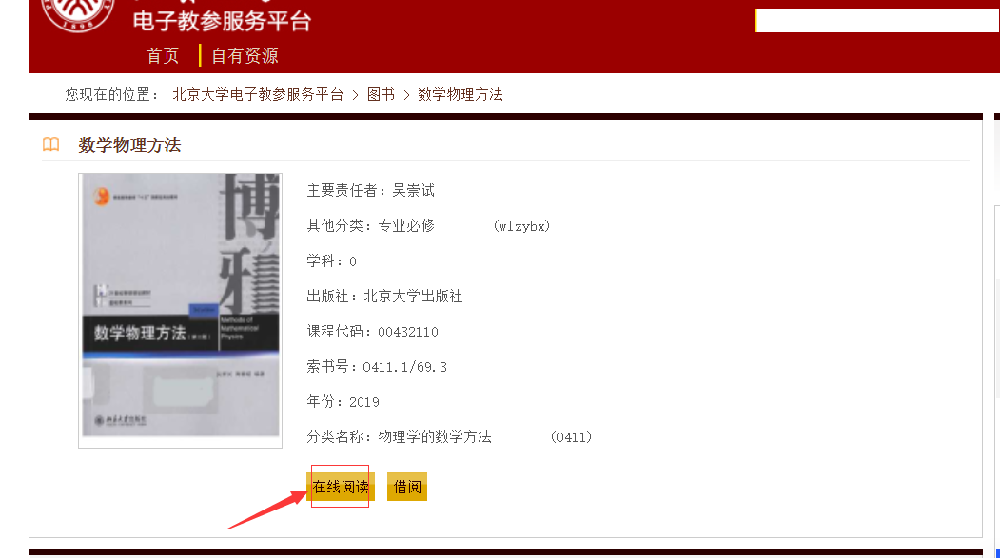
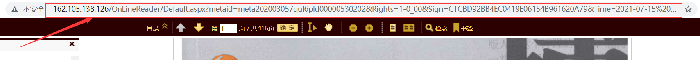

# PKUbookpdfDownloader
[北京大学教参平台](http://162.105.138.126/Usp)下载pdf电子书

## 介绍

本项目基于python requests等第三方库。可以从[北京大学教参平台](http://162.105.138.126/Usp)爬取指定教参书图片，并转换为pdf.

！！！**本工具仅作为学习交流使用，禁止以任何形式传播爬虫得到的信息，禁止以任何形式使用本项目牟利，如有违反，开发者不承担任何责任**

## 安装

### 说明

在下载前，您需要确保同意以下条目

- [ ] 您不会以任何形式传播本代码爬取的电子书
- [ ] 您不会使用本工具得到的电子书牟利
- [ ] 您不会以任何形式修改、商用、传播本代码
- [ ] 您不会过多使用本工具，以攻击[北京大学教参平台](http://162.105.138.126/Usp)服务器
- [ ] 一切违反上述条目的行为，您会承担所有责任，并对开发者免责

### 下载本项目

您可以点击上面的绿色按钮`Code`，再点击`Download Zip`将本项目下载到本地，或者直接在本地输入以下命令（如果您安装了git）

`git clone https://github.com/rockmagma02/PKUbookpdfDownloader.git`

### 配置环境

推荐使用python3.7及以上的环境（开发环境为3.7.3）

- 如果您没有安装过python，请从官网下载并安装python3.7及以上的版本
- 如果您目前的版本低于3.7，建议您卸载后重装更新的版本
- 如果您使用conda，可以直接使用以下命令新建一个环境

`conda create -n pkudownloader python=3.7.3`

本项目使用了`requests`, `urllib3`, `beautifulsoup4`, `Pillow`, `tqdm`

首先请在命令行内`cd`切换到项目的本地目录，再使用以下语句

`pip3 install -r requirements.txt`

## 使用

首先请登录[北京大学教参平台](http://162.105.138.126/Usp)，找到您需要下载的电子书.

打开该电子书页面，再点击在线阅读.

等待在线阅读器加载完毕后，复制网站url

请在命令行内`cd`切换到项目的本地目录，再使用以下语句

`python pdfdownloader.py`

按照命令行提示输入对应信息，等待进度条完成

下载的电子书将保存到项目目录下的`/PDF/`内.

